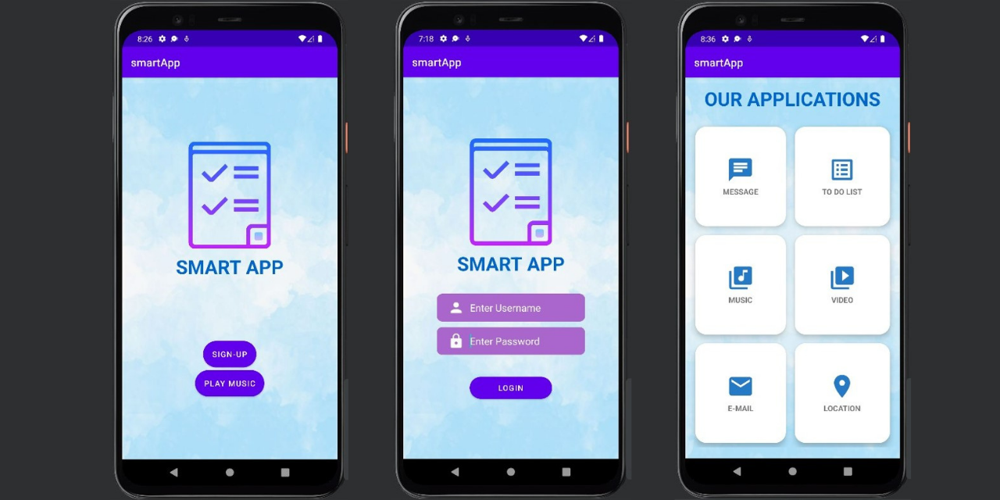

# Smart Android Application using Java and XML Programming Languages (Android Studio)
This is a project of the Wireless and Mobile Programming course that we worked on in a group team called 'JAM Group'. In this project, we created a Smart Android Application that can do several things in one application such as do a user sign-in and sign-up, send a message/chat, make a to-do list, play and download music and video, send an email, and get location/maps. We created this application using Android Studio with Java and XML programming languages and it also connected to the database. 

